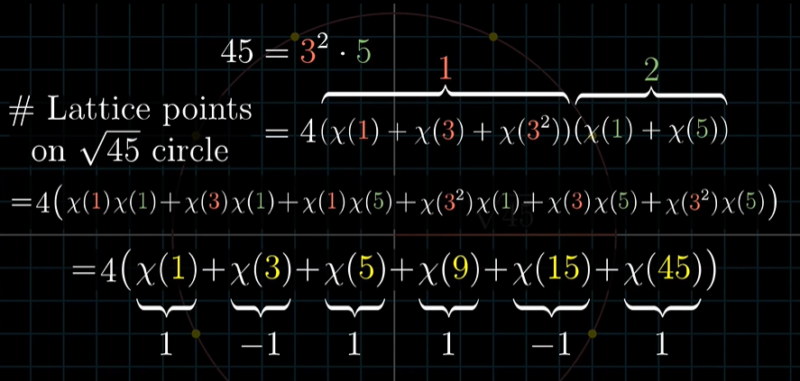

# 勾股数/圆上格点数

## 勾股数

$a^2+ b^2 = c^2$

1.任何一个勾股数(a,b,c)内的三个数同时乘以一个正整数n得到的新数组(na, nb, nc)仍然是勾股数，

于是找abc互质的勾股数

一，当a为大于1的奇数2n+1时，$b=2n^2+2n，c=2n ^ 2 + 2n +1$

（把a拆成两个连续的自然数）

二，当a为大于4的偶数2n时，$b = n^2 - 1, c = n^2 + 1$

（只想得到互质的数的话：a=4n，$b = 4n^2 - 1,c = 4n^2+1$

**公式1**

a=2mnt

b=（m²-n²）t

c=（m²+n²）t

（t是倍数）

**完全公式**

a=m，b=(m^2 / k - k) / 2，c=(m^2 / k + k) / 2 ①

其中m ≥3

⒈ 当m确定为任意一个 ≥3的奇数时，k={1，m^2的所有小于m的因子}

⒉ 当m确定为任意一个 ≥4的偶数时，k={m^2 / 2的所有小于m的偶数因子}

## 高斯整数/高斯素数

[3B1B的视频](https://www.bilibili.com/video/av12131743/)

[洛谷某题](https://www.luogu.com.cn/problem/P2508)

二维平面转化为复数平面，

4n+1的素数，都能分解成高斯素数，4n+3的素数，他们本身就是高斯素数，2特殊

（乘以1， -1， i，-i 四个

半径为$\sqrt{n}$的圆上的格点数，先将n分解质因数，对每个不是高斯素数的数分解成共轭的高斯素数，分配数比指数多1，指数是偶数的话，有一种方法分配，不然就没有格点

2 = (1+ i)(1 + i) ，但是这对数格点数没有影响，因为要乘-i。
$$
引入 f(x) = \begin{cases}
1 ,x 为素数 x = 4n+1 \\
-1, x为素数 x = 4n+3 \\
0, x为偶数\\
\end{cases}
$$
它是一个周期函数，同时是一个积性函数，

再来看这个问题，
$$
45 = 3^2 \times 5 \\
半径为 \sqrt{45} 圆上格点数问题 = 4 \times (f(1)+f(3)+f(3^2)) \times(f(1)+f(5))\\
=4 \times (f(1)+f(3)+f(5)+f(9)+f(15)+f(45))
$$
最后转化为45的所有约数
$$
f(x) = \begin{cases}
1 ,x 为素数 x = 4n+1 \\
-1, x为素数 x = 4n+3 \\
0, x为偶数\\
\end{cases}\\
半径为\sqrt { n}的圆上的格点数（二维坐标轴xy都为整数的点）是4 \times \sum_{d|n}f(d)
$$
